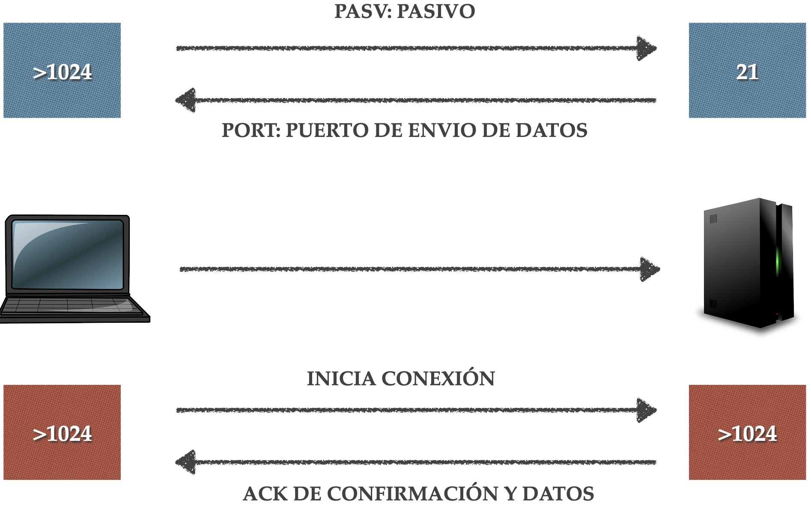

# Modos de conexión.

Se usa dos canales de comunicación entre el cliente y el servidor.

El primero o canal de control se usará para establecer la comunicación y el intercambio de comandos y permanecerá activo durante todo el tiempo que dure la comunicación.

El segundo o canal de datos se usará para el intercambio de ficheros y existe dos formas de crear este canal dependiente de quien crea la conexión: modo activo y modo pasivo.

# Modo activo

El cliente envía una petición desde cualquier puerto mayor al 1024 (Ej:1051) al 21 del servidor. Este mensaje contiene el puerto que va a usar el cliente para el canal de datos (Ej: 1052).

El servidor responde con un mensaje de aceptación ACK.

El servidor inicia la conexión del canal de datos desde su puerto 20 al puerto que indicó el cliente mayor a 1024 (Ej: 1052) 

El cliente responde con un mensaje de confirmación ACK.

# Modo pasivo

El cliente envía una petición desde cualquier puerto mayor al 1024 (Ej: 1051) al 21 del servidor. Indica qué va a usar el modo pasivo.

El servidor responde con un mensaje incluyendo el puerto al que el cliente debe dirigirse para crear la conexión de datos (Ej: 2000).

El cliente inicia la conexión del canal de datos desde un puerto mayor al 1024 (Ej: 1052) al puerto que indicó el servidor (Ej: 2000) 

El servidor responde con un mensaje de confirmación ACK.

# Activo vs Pasivo

La diferencia principal entre los dos modos de conexión es que en el modo activo es el servidor el que inicia la conexión del canal de datos y en el modo pasivo es el cliente el que inicia la conexión del canal de datos.

En el modo activo el cliente debe aceptar conexiones TCP entrantes, si el cliente está detrás de un cortafuegos lo normal es que este bloquee cualquier conexión entrante para evitar riesgos de seguridad. Esto no ocurre en el modo pasivo.
