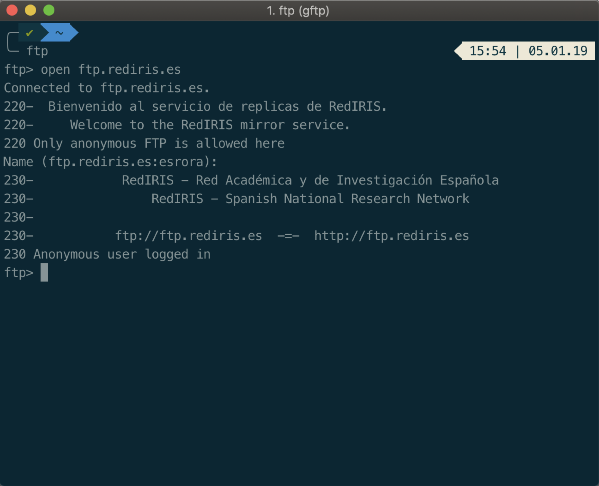
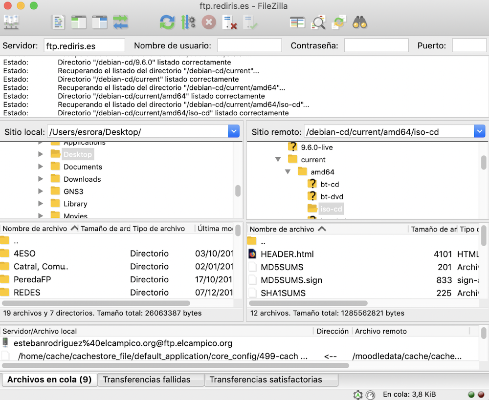

# Comandos

| ORDEN | DESCRIPCIÓN | EJEMPLO |
|:-------------------:|---|---|
| open | Abre conexión | open 192.168.0.1 |
| dir, ls | Mostrar contenido del directorio | ls |
| cd | Cambiar de directorio | cd Escritorio |
| get | Descargar fichero | get index.html |
| put | Subir fichero | put index.html |
| close | Cierra la conexión | close |
| quit | Cierra la conexión y el programa | quit |

# Tipos de usuarios

Para acceder al servidor FTP tenemos 3 tipos de usuarios, que no tiene porqué estar activados de forma simultánea en el servidor.

- **Anónimo**: Este usuario (anonymous) donde la contraseña es un correo electrónico permite acceder al servidor FTP a una carpeta en forma de sólo lectura. Se suele usar para compartir ciertos documentos, software, … con todos los clientes, por ejemplo, las distribuciones Linux. [FTP de Rediris](ftp://ftp.rediris.es/)
- **Local**: Estos son los usuarios del servidor, es decir, son usuarios que están dados de alta en el servidor donde tenemos instalado el servicio FTP. Son usuarios que tienen su carpeta local en el servidor y pueden acceder al servicio FTP con el mismo usuario y contraseña que usan para entrar al servidor.
- **Virtual**: Estos usuarios sólo existen dentro del servidor FTP y el usuario y contraseña proporcionado sólo se puede usar para acceder al FTP.

# Clientes FTP

Existen diferentes formas de acceder al servicio FTP, mediante la consola o terminal

Existen clientes gráficos que facilitan la conexión y el intercambio de ficheros.

